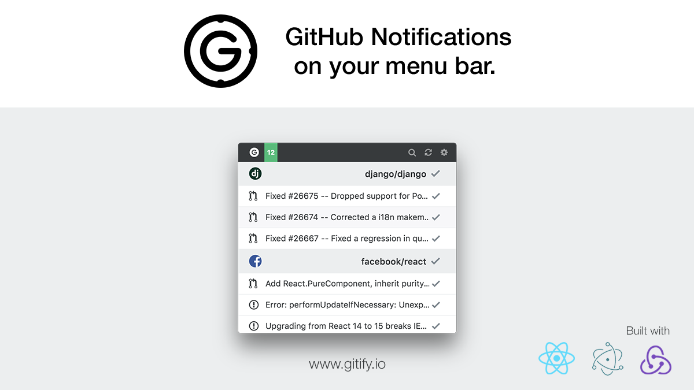

# Gitify

[![travis][travis-image]][travis-url]
[![cc-gpa][cc-gpa-image]][cc-gpa-url]
[![cc-coverage][cc-coverage-image]][cc-coverage-url]

[travis-image]: https://travis-ci.org/ekonstantinidis/gitify.svg?branch=master
[travis-url]: https://travis-ci.org/ekonstantinidis/gitify
[cc-gpa-image]: https://codeclimate.com/github/ekonstantinidis/gitify/badges/gpa.svg
[cc-gpa-url]: https://codeclimate.com/github/ekonstantinidis/gitify
[cc-coverage-image]: https://codeclimate.com/github/ekonstantinidis/gitify/badges/coverage.svg
[cc-coverage-url]: https://codeclimate.com/github/ekonstantinidis/gitify/coverage

### GitHub Notifications on your menu bar.

### Download
You can download Gitify for **free** from either the website [www.gitify.io](http://www.gitify.io/) or from the GitHub repository [releases](https://github.com/ekonstantinidis/gitify/releases) page. Currently only supports OS X.

### Prerequisites

 - [Electron](http://electron.atom.io/)
 - [React](https://facebook.github.io/react/)
 - [Grunt](http://gruntjs.com/)
 - [NPM](https://www.npmjs.com/)

### Installation

    npm install

### Development
First you will need to set the testing `client_id` and `client_secret_key` in the `src/js/components/login.js`. You can use the development app credentials(use at your own discretion):

    Client Id: 3fef4433a29c6ad8f22c
    Client Secret Key: 9670de733096c15322183ff17ed0fc8704050379

To watch for changes in the `src` directory:

    npm run watch

To run the actual **electron app**:

    npm start

### Distribution
To prepare the app for distribution run:

    npm run package

To publish a new version, you also need to codesign the app running `npm run codesign`. Currently supports only OS X.

### Tests
There are 2 types of tests: `jest` and `eslint`.
To run the tests:

    npm test

### Contributing

1. Fork it!
2. Create your feature branch: `git checkout -b my-new-feature`
3. Commit your changes: `git commit -am 'Add some feature'`
4. Push to the branch: `git push origin my-new-feature`
5. Submit a pull request
6. Make sure tests are passing

### License
Gitify is licensed under the MIT Open Source license. For more information, see the LICENSE file in this repository.
