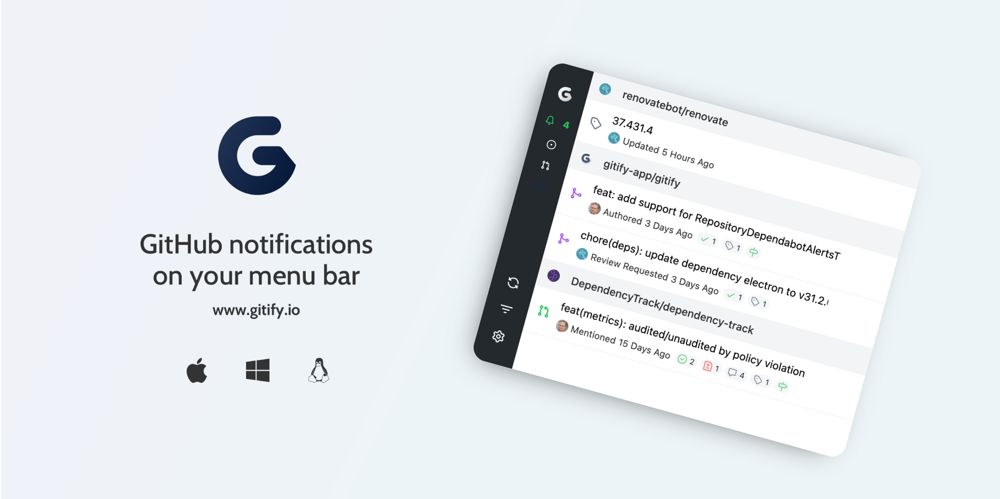

# Gitify [![github][github-image]][github-url] [![codecov][codecov-image]][codecov-url] [![downloads][downloads-image]][downloads-url]

> GitHub Notifications on your menu bar. Available on macOS, Windows and Linux. Gitify Mobile has been deprecated in favour of the official [GitHub mobile app](https://github.com/mobile).



### Download

You can download Gitify for **free** from the website [www.gitify.io](https://www.gitify.io/) or install it via [Homebrew Cask](http://brew.sh/).

```shell
brew install --cask gitify
```

Gitify supports macOS, Windows and Linux.

### Prerequisites & Libraries

- Node 12+
- [Yarn](https://yarnpkg.com/)
- [Electron](https://electronjs.org/)
- [TypeScript](https://www.typescriptlang.org/)
- [React](https://reactjs.org/)
- [Tailwind CSS](https://tailwindcss.com/)

### Installation

    yarn install

### Development

Optional: If you prefer to use your own OAuth credentials, you can do so by passing them as environment variables when bundling the app. This is optional as the app has some default "development" keys (use at your own discretion).

    OAUTH_CLIENT_ID="123" OAUTH_CLIENT_SECRET="456789" yarn build

To watch for changes(`webpack`) in the `src` directory:

    yarn run watch

To run the **electron app**:

    yarn start

### Releases

The release process is automated. Follow the steps below.

1. Create a [new **draft** release](https://github.com/manosim/gitify/releases/new). Set the tag version to something with the format of `v1.2.3`. Save as a **draft**.
2. Once everything is merged to `main`, create a branch that starts with `release/vX.X.X` (ie. `release/v1.2.3`).
3. In the same branch, **bump the version** of the app in the `package.json` file and open a PR. GitHub Actions will build, sign and upload the release assets for each commit to that branch as long as a branch is named like `release/vX.X.X` and there is a draft release with the same version number(`package.json`).
4. Merge your release branch into `main`.
5. Publish the draft release once you've added notes to it and all assets are there.

### Tests

There are 2 checks - one for prettier and one for the unit tests with `jest`.

    // Run prettier to check
    yarn run prettier:check

    // Run linter & unit tests with coverage
    yarn run test

    // Run jest directly - allows to pass arguments like `--watch`
    yarn run jest

### FAQ

#### My notifications aren't showing?

Some organisations require applications to request access before allowing access to any data (including notifications) about their repositories.

To check if Gitify is approved by your organisation you can go to https://github.com/settings/applications, then click on **Gitify** and scroll to _Organization access_.

#### Something looks wrong - How can I debug?

You can debug Gitify by pressing <kbd>alt</kbd> + <kbd>command</kbd> + <kbd>I</kbd>. This will open the dev tools and then you can see any logs, network requests etc.

### Contributing

1. Fork it!
2. Create your feature branch: `git checkout -b my-new-feature`
3. Commit your changes: `git commit -am 'Add some feature'`
4. Push to the branch: `git push origin my-new-feature`
5. Submit a pull request
6. Make sure tests are passing

### License

Gitify is licensed under the MIT Open Source license. For more information, see the LICENSE file in this repository.

[github-image]: https://github.com/manosim/gitify/workflows/CI/badge.svg
[github-url]: https://github.com/manosim/gitify/actions
[codecov-image]: https://codecov.io/gh/manosim/gitify/branch/main/graph/badge.svg
[codecov-url]: https://codecov.io/gh/manosim/gitify
[downloads-image]: https://img.shields.io/github/downloads/manosim/gitify/total.svg
[downloads-url]: https://www.gitify.io
